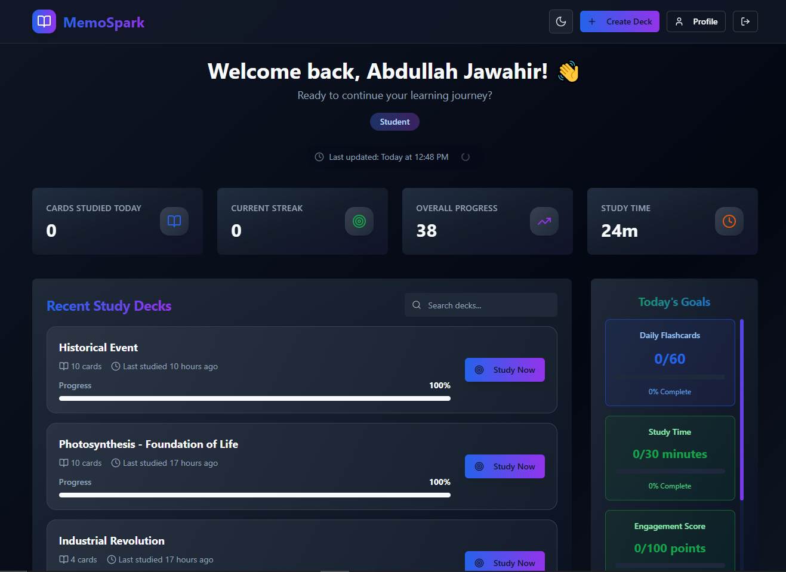
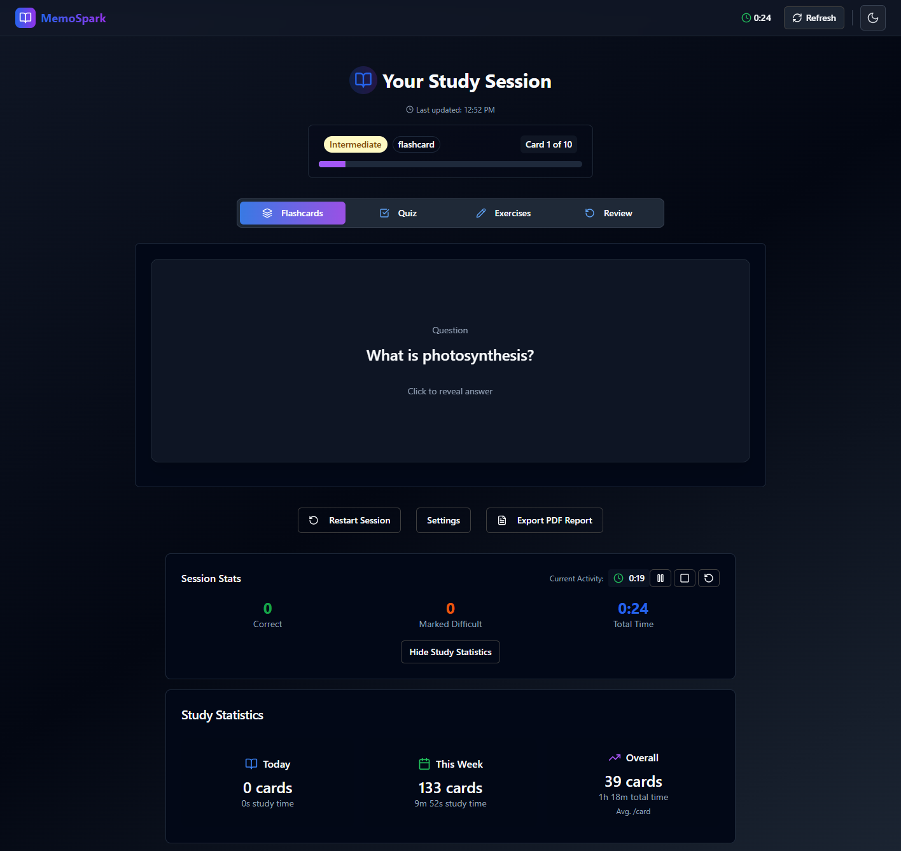
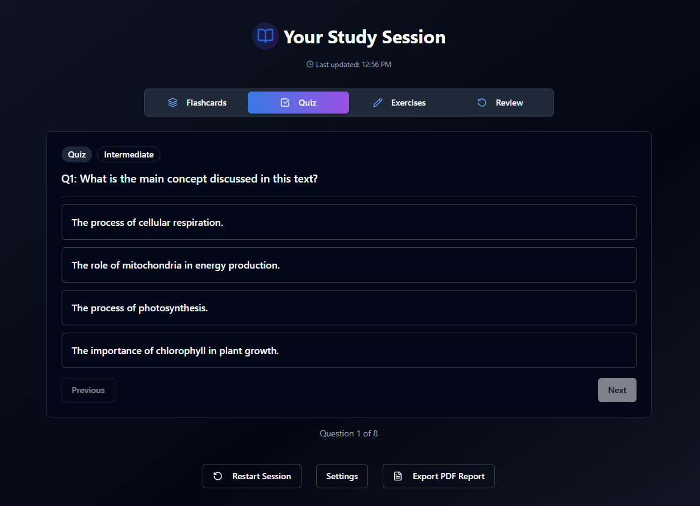
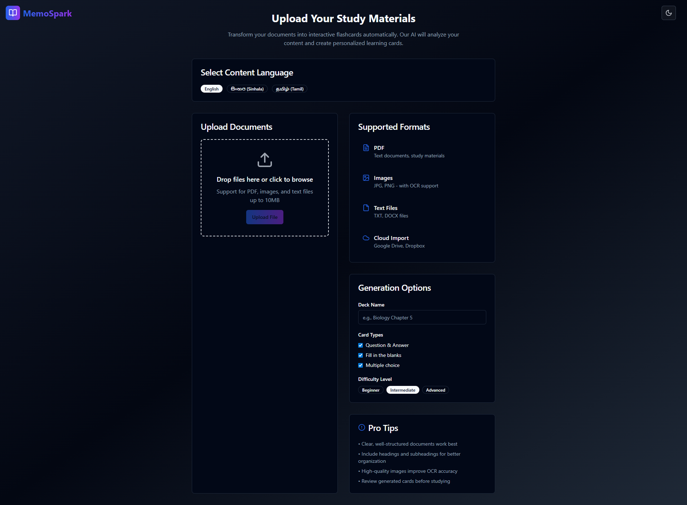
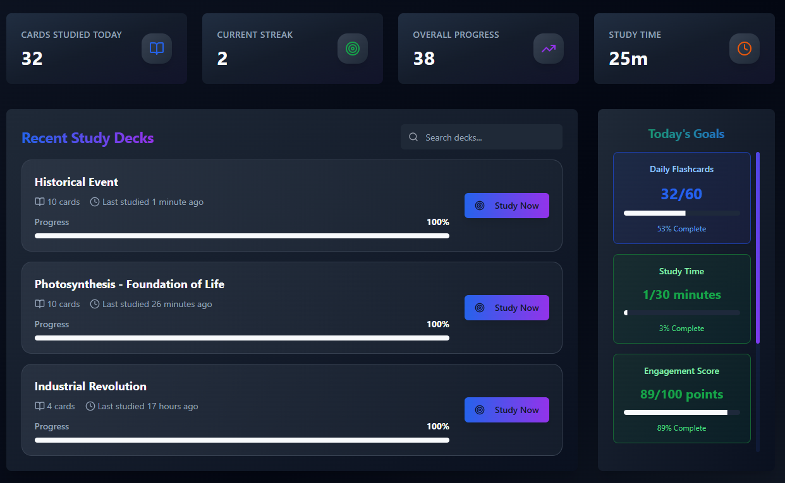

# 🎓 MemoSpark - AI-Powered Learning Platform

<div align="center">

**✨ Transform your documents into interactive learning experiences with AI**

[](https://reactjs.org/)
[](https://www.typescriptlang.org/)
[](https://vitejs.dev/)
[](https://tailwindcss.com/)
[](https://opensource.org/licenses/MIT)

[📚 Documentation](https://github.com/Abdullah-Jawahir/memo-spark/wiki) • [🐛 Report Bug](https://github.com/Abdullah-Jawahir/memo-spark/issues) • [💡 Request Feature](https://github.com/Abdullah-Jawahir/memo-spark/issues)

</div>

## 📋 Table of Contents

- [🌟 Overview](#-overview)
- [✨ Features](#-features)
- [🎯 Demo](#-demo)
- [🛠️ Tech Stack](#️-tech-stack)
- [🚀 Quick Start](#-quick-start)
- [📁 Project Structure](#-project-structure)
- [🔧 Configuration](#-configuration)
- [📚 API Integration](#-api-integration)
- [🌐 Internationalization](#-internationalization)
- [🧪 Testing](#-testing)
- [📦 Deployment](#-deployment)
- [🤝 Contributing](#-contributing)
- [📄 License](#-license)
- [👨‍💻 Author](#-author)

## 🌟 Overview

MemoSpark is an innovative AI-powered learning platform that transforms static documents into dynamic, interactive learning experiences. Upload your PDFs, Word documents, or PowerPoint presentations, and let our advanced AI generate personalized flashcards, quizzes, and exercises tailored to your learning style and difficulty preferences.

### 🎯 Problem Solved

Traditional studying methods are often passive and one-size-fits-all. MemoSpark addresses this by:

- Converting static content into interactive learning materials
- Personalizing content based on user preferences and learning goals
- Supporting multiple languages (English, Sinhala, Tamil)
- Providing intelligent progress tracking and analytics
- Enabling collaborative learning through shared study sets

## ✨ Features

### 🚀 Core Features

- **📄 Document Processing**: Support for PDF, DOCX, and PPTX files
- **🤖 AI Content Generation**: Generate flashcards, quizzes, and exercises using advanced AI models
- **🌍 Multi-language Support**: Full support for English, Sinhala, and Tamil
- **📊 Smart Analytics**: Track learning progress with detailed statistics
- **🎯 Adaptive Learning**: Difficulty adjustment based on performance
- **🔍 Advanced Search**: Find specific flashcards and study materials quickly

### 🎨 User Experience

- **🌙 Dark/Light Mode**: Seamless theme switching
- **📱 Responsive Design**: Perfect experience across all devices
- **⚡ Fast Performance**: Optimized loading and rendering
- **🎵 Interactive UI**: Smooth animations and transitions
- **♿ Accessibility**: ARIA compliant and keyboard navigation

### 👥 User Management

- **🔐 Secure Authentication**: Email-based authentication with Supabase
- **👤 User Profiles**: Customizable learning preferences
- **📈 Progress Tracking**: Detailed learning analytics
- **🎖️ Achievement System**: Gamification elements

### 🔧 Administration

- **👨‍💼 Admin Dashboard**: Comprehensive user and content management
- **📊 Analytics Dashboard**: Platform usage insights
- **⚙️ Goal Settings**: Configure learning objectives
- **🛡️ Security Controls**: User access and permission management

## 🎯 Demo

### Screenshots

<div align="center">

**Dashboard**


**Study Mode**


**Quiz Generation**


**Document Upload**


**Analytics**


**Mobile View**


</div>

## 🛠️ Tech Stack

### Frontend Framework

- **⚛️ React 18** - Modern React with hooks and concurrent features
- **📘 TypeScript** - Type safety and enhanced developer experience
- **⚡ Vite** - Ultra-fast build tool and development server

### UI & Styling

- **🎨 Tailwind CSS** - Utility-first CSS framework
- **🧩 Shadcn/ui** - High-quality, accessible React components
- **🎭 Radix UI** - Unstyled, accessible UI primitives
- **✨ Framer Motion** - Production-ready motion library

### State Management & Data Fetching

- **🔄 TanStack Query** - Powerful data synchronization
- **🌍 React Context** - Global state management
- **📡 Axios** - HTTP client for API requests

### Authentication & Database

- **🔐 Supabase** - Backend-as-a-Service with authentication
- **🗄️ PostgreSQL** - Robust relational database

### Development Tools

- **🧹 ESLint** - Code linting and formatting
- **🔍 TypeScript Compiler** - Static type checking
- **🛠️ Vite DevTools** - Enhanced development experience

### Deployment & CI/CD

- **🚀 Vercel** - Serverless deployment platform
- **📦 GitHub Actions** - Automated CI/CD pipelines

## 🚀 Quick Start

### Prerequisites

Ensure you have the following installed:

- **Node.js** (v18 or higher) - [Download](https://nodejs.org/)
- **npm** or **yarn** - Package manager
- **Git** - Version control

### Installation

1. **Clone the repository**

   ```bash
   git clone https://github.com/Abdullah-Jawahir/memo-spark.git
   cd memo-spark
   ```

2. **Install dependencies**

   ```bash
   npm install
   # or
   yarn install
   ```

3. **Environment setup**

   ```bash
   cp .env.example .env.local
   ```

   Configure your environment variables:

   ```env
   VITE_SUPABASE_URL=your_supabase_url
   VITE_SUPABASE_ANON_KEY=your_supabase_anon_key
   VITE_FASTAPI_URL=http://localhost:8000
   VITE_LARAVEL_URL=http://localhost:8001
   ```

4. **Start development server**

   ```bash
   npm run dev
   ```

5. **## 📁 Project Structure

```
memo-spark/
├── public/                     # Static assets
│   ├── favicon.ico            # Favicon
│   ├── placeholder.svg        # Placeholder images
│   └── robots.txt            # SEO configuration
├── src/
│   ├── components/            # Reusable UI components
│   │   ├── ui/               # Shadcn/ui components
│   │   ├── layout/           # Layout components
│   │   ├── forms/            # Form components
│   │   └── charts/           # Chart components
│   ├── pages/                # Route components
│   │   ├── admin/            # Admin dashboard pages
│   │   ├── auth/             # Authentication pages
│   │   └── *.tsx             # Main application pages
│   ├── contexts/             # React Context providers
│   │   ├── AuthContext.tsx   # Authentication state
│   │   └── ThemeContext.tsx  # Theme management
│   ├── hooks/                # Custom React hooks
│   ├── lib/                  # Utility libraries
│   ├── utils/                # Helper functions
│   ├── integrations/         # External service integrations
│   ├── locales/              # Internationalization files
│   ├── config/               # Application configuration
│   └── tests/                # Test files
├── docs/                      # Documentation
├── supabase/                  # Supabase configuration
└── package.json              # Dependencies and scripts
```

## 🔧 Configuration

### Environment Variables

Create a `.env.local` file in the root directory:

```env
# Supabase Configuration
VITE_SUPABASE_URL=https://your-project.supabase.co
VITE_SUPABASE_ANON_KEY=your-supabase-anon-key

# Backend Services
VITE_FASTAPI_URL=http://localhost:8000
VITE_LARAVEL_URL=http://localhost:8001

# Application Settings
VITE_APP_NAME=MemoSpark
VITE_APP_VERSION=1.0.0
VITE_APP_DESCRIPTION="AI-Powered Learning Platform"

# Feature Flags
VITE_ENABLE_ANALYTICS=true
VITE_ENABLE_NOTIFICATIONS=true
VITE_ENABLE_COLLABORATION=true
```

### Build Configuration

The project uses Vite for building and development. Key configurations:

- **Vite Config**: `vite.config.ts`
- **TypeScript Config**: `tsconfig.json`
- **Tailwind Config**: `tailwind.config.ts`
- **ESLint Config**: `eslint.config.js`

## 📚 API Integration

### FastAPI Integration (AI Processing)

```typescript
// Document processing and AI generation
const uploadDocument = async (file: File, options: ProcessingOptions) => {
  const formData = new FormData();
  formData.append('file', file);
  formData.append('language', options.language);
  formData.append('difficulty', options.difficulty);
  
  const response = await axios.post(`${FASTAPI_URL}/process-file`, formData);
  return response.data;
};
```

### Laravel Integration (Data Management)

```typescript
// User data and study progress
const getUserProgress = async (userId: string) => {
  const response = await axios.get(`${LARAVEL_URL}/api/users/${userId}/progress`);
  return response.data;
};
```

### Supabase Integration (Authentication)

```typescript
// Authentication and real-time features
import { createClient } from '@supabase/supabase-js';

const supabase = createClient(
  process.env.VITE_SUPABASE_URL!,
  process.env.VITE_SUPABASE_ANON_KEY!
);
```

## 🌐 Internationalization

MemoSpark supports multiple languages with complete translations:

### Supported Languages

- **🇺🇸 English** - Primary language
- **🇱🇰 Sinhala** - සිංහල
- **🇱🇰 Tamil** - தமிழ்

### Adding New Translations

1. **Create language file**

   ```json
   // src/locales/fr.json
   {
     "common": {
       "welcome": "Bienvenue",
       "continue": "Continuer"
     }
   }
   ```

2. **Update i18n configuration**

   ```typescript
   // src/i18n.ts
   import fr from './locales/fr.json';
   
   resources: {
     en: { translation: en },
     si: { translation: si },
     ta: { translation: ta },
     fr: { translation: fr } // Add new language
   }
   ```

## 🧪 Testing

### Running Tests

```bash
# Run all tests
npm run test

# Run tests in watch mode
npm run test:watch

# Run tests with coverage
npm run test:coverage

# Run e2e tests
npm run test:e2e
```

### Test Structure

```
src/tests/
├── __mocks__/             # Mock files
├── components/            # Component tests
├── pages/                # Page tests
├── hooks/                # Hook tests
├── utils/                # Utility tests
└── e2e/                  # End-to-end tests
```

### Writing Tests

```typescript
// Example component test
import { render, screen } from '@testing-library/react';
import { Dashboard } from '../pages/Dashboard';

describe('Dashboard', () => {
  it('renders welcome message', () => {
    render(<Dashboard />);
    expect(screen.getByText('Welcome to MemoSpark')).toBeInTheDocument();
  });
});
```

## 📦 Deployment

### Production Build

```bash
# Create production build
npm run build

# Preview production build locally
npm run preview
```

### Vercel Deployment (Recommended)

1. **Connect to Vercel**

   ```bash
   npm i -g vercel
   vercel login
   vercel
   ```

2. **Configure environment variables** in Vercel dashboard

3. **Auto-deployment** - Pushes to main branch trigger automatic deployments

### Alternative Deployment Options

#### Netlify

```bash
# Build command
npm run build

# Publish directory
dist
```

#### Docker

```dockerfile
FROM node:18-alpine as build
WORKDIR /app
COPY package*.json ./
RUN npm ci
COPY . .
RUN npm run build

FROM nginx:alpine
COPY --from=build /app/dist /usr/share/nginx/html
EXPOSE 80
CMD ["nginx", "-g", "daemon off;"]
```

## 🤝 Contributing

We welcome contributions! Please follow our guidelines:

### Development Workflow

1. **Fork the repository**
2. **Create a feature branch**

   ```bash
   git checkout -b feature/amazing-feature
   ```

3. **Make changes and commit**

   ```bash
   git commit -m "Add amazing feature"
   ```

4. **Push to your branch**

   ```bash
   git push origin feature/amazing-feature
   ```

5. **Open a Pull Request**

### Code Standards

- **TypeScript** - All new code must be TypeScript
- **ESLint** - Follow existing linting rules
- **Prettier** - Code formatting is automated
- **Conventional Commits** - Use conventional commit messages

### Commit Message Format

```
type(scope): description

feat(auth): add social login support
fix(ui): resolve mobile navigation issue
docs(readme): update installation instructions
```

## 📄 License

This project is licensed under the MIT License - see the [LICENSE](LICENSE) file for details.

```
MIT License

Copyright (c) 2025 Abdullah Jawahir

Permission is hereby granted, free of charge, to any person obtaining a copy
of this software and associated documentation files (the "Software"), to deal
in the Software without restriction, including without limitation the rights
to use, copy, modify, merge, publish, distribute, sublicense, and/or sell
copies of the Software, and to permit persons to whom the Software is
furnished to do so, subject to the following conditions:

The above copyright notice and this permission notice shall be included in all
copies or substantial portions of the Software.

THE SOFTWARE IS PROVIDED "AS IS", WITHOUT WARRANTY OF ANY KIND, EXPRESS OR
IMPLIED, INCLUDING BUT NOT LIMITED TO THE WARRANTIES OF MERCHANTABILITY,
FITNESS FOR A PARTICULAR PURPOSE AND NONINFRINGEMENT. IN NO EVENT SHALL THE
AUTHORS OR COPYRIGHT HOLDERS BE LIABLE FOR ANY CLAIM, DAMAGES OR OTHER
LIABILITY, WHETHER IN AN ACTION OF CONTRACT, TORT OR OTHERWISE, ARISING FROM,
OUT OF OR IN CONNECTION WITH THE SOFTWARE OR THE USE OR OTHER DEALINGS IN THE
SOFTWARE.
```

## 👨‍💻 Author

<div align="center">

### **Abdullah Jawahir**

*Full-Stack Developer & AI Enthusiast*

[](https://linkedin.com/in/abdullah-jawahir)
[](https://github.com/Abdullah-Jawahir)
[](mailto:abdullahjawahir@gmail.com)

**Made with ❤️ by Abdullah Jawahir**

*"Transforming education through the power of AI and innovative technology"*

</div>

---

<div align="center">

**🌟 If you found this project helpful, please give it a star! 🌟**

**🔄 Stay updated with the latest features and improvements**

**📧 Questions? Feedback? Reach out anytime!**

</div>
- Edit files directly within the Codespace and commit and push your changes once you're done.

## What technologies are used for this project?

This project is built with:

- Vite
- TypeScript
- React
- shadcn-ui
- Tailwind CSS
